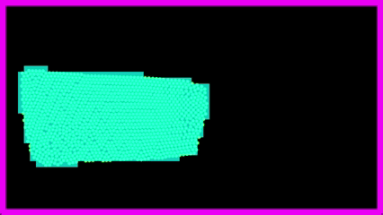
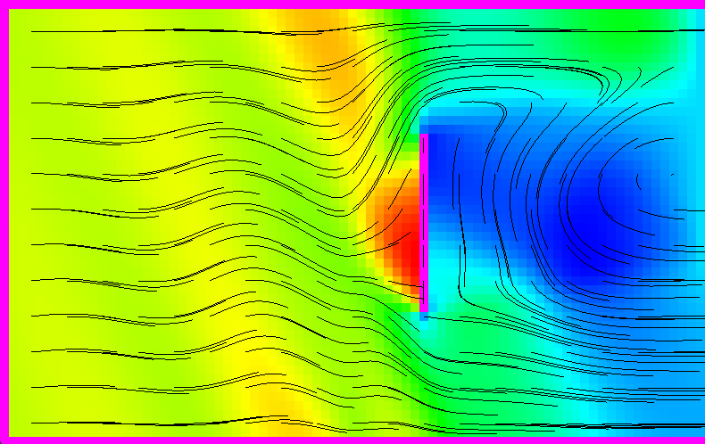

# 2D Fluid simulator based on FLIP/PIC method

This project consists of a 2D fluid simulation developed in C++ based on the FLIP/PIC simulation method. It uses SFML for the rendering.

Special Thanks to [TenMinutePhysics](https://www.youtube.com/@TenMinutePhysics/videos) for his great physics simulation videos.

Copyright (c) 2025 Luc_Creeper74 - 2D-FluidSim is under the Apache 2.0 License.

## Previews
*Purple pixels is walls, black lines represent streamlines, RED = high pressure, BLUE = low pressure.*

### Fluid Simulation - Semi-Lagrangian Flip/Pic

### Smoke Chamber - Eularian method

### Smoke Chamber - Pressure Gradient

